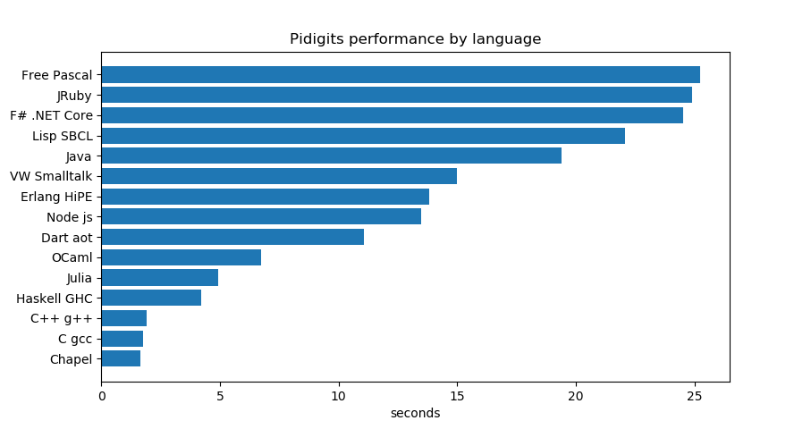

Here is a curated list of the [Benchmarks Game pidigits results](https://benchmarksgame-team.pages.debian.net/benchmarksgame/performance/pidigits.html). 

Every programs calling the [gmp library](https://gmplib.org/) have been removed because first it's almost like cheating and second I wanted to see how *really* could fare the language in this pure single threaded integer type of calculation. I also removed all "dialectal variations" from the same language, keeping only the best one in this benchmark. The algorithm is simple, very well known and you can't really get over it.

If we get the "low level languages" like [Chapel](https://www.chapel-lang.org/) and C/C++ out of the picture, then Haskell, Julia, Ocaml are really very good contenders as high level languages, but Julia high level memory consumption is a little daunting (Ok, Java's one is insane). I'm really disapointed about F#, which couldn't even do better than good ol' grand'pa lisp.

<table>
      <tbody><tr>
        <th>×
        </th><th>source
        </th><th class="best">secs
        </th><th><a href="./pidigits-mem.html">mem</a>
        </th><th><a href="./pidigits-gz.html">gz</a>
        </th><th><a href="./pidigits-cpu.html">busy</a>
        </th><th>cpu load
      </th></tr><tr>
        <td>1
        </td><td><a href="https://benchmarksgame-team.pages.debian.net/benchmarksgame/program/pidigits-chapel-1.html">Chapel</a>
        </td><td>1.63
        </td><td>6,180
        </td><td>501
        </td><td>1.68
        </td><td class="message">99%&nbsp;1%&nbsp;2%&nbsp;1%
      </td></tr><tr>
        <td>2
        </td><td><a href="https://benchmarksgame-team.pages.debian.net/benchmarksgame/program/pidigits-gcc-1.html"><strong>C</strong>&nbsp;gcc</a>
        </td><td class="best">1.75
        </td><td>2,660
        </td><td>452
        </td><td>2.02
        </td><td class="message">1%&nbsp;100%&nbsp;14%&nbsp;1%
      </td></tr><tr>
        <td>3
        </td><td><a href="https://benchmarksgame-team.pages.debian.net/benchmarksgame/program/pidigits-gpp-4.html"><strong>C++</strong>&nbsp;g++</a>
        </td><td class="best">1.89
        </td><td>4,460
        </td><td>513
        </td><td>1.97
        </td><td class="message">100%&nbsp;2%&nbsp;2%&nbsp;1%
      </td></tr><tr>
        <td>4
        </td><td><a href="https://benchmarksgame-team.pages.debian.net/benchmarksgame/program/pidigits-ghc-3.html"><strong>Haskell</strong>&nbsp;GHC</a>
        </td><td class="best">4.20
        </td><td>10,248
        </td><td>379
        </td><td>5.32
        </td><td class="message">86%&nbsp;9%&nbsp;8%&nbsp;23%
      </td></tr><tr>
        <td>5
        </td><td><a href="https://benchmarksgame-team.pages.debian.net/benchmarksgame/program/pidigits-julia-1.html"><strong>Julia</strong></a>
        </td><td class="best">4.91
        </td><td>192,912
        </td><td>275
        </td><td>5.50
        </td><td class="message">3%&nbsp;6%&nbsp;4%&nbsp;99%
      </td></tr><tr>
        <td>6
        </td><td><a href="https://benchmarksgame-team.pages.debian.net/benchmarksgame/program/pidigits-ocaml-5.html"><strong>OCaml</strong></a>
        </td><td class="best">6.74
        </td><td>20,020
        </td><td>458
        </td><td>6.84
        </td><td class="message">1%&nbsp;1%&nbsp;100%&nbsp;0%
      </td></tr><tr>
        <td>7
        </td><td><a href="https://benchmarksgame-team.pages.debian.net/benchmarksgame/program/pidigits-dartsnapshot-2.html"><strong>Dart</strong> aot</a>
        </td><td class="best">11.07
        </td><td>90,996
        </td><td>500
        </td><td>11.41
        </td><td class="message">99%&nbsp;1%&nbsp;1%&nbsp;2%
      </td></tr><tr>
        <td>8
        </td><td><a href="https://benchmarksgame-team.pages.debian.net/benchmarksgame/program/pidigits-node-4.html"><strong>Node js</strong></a>
        </td><td class="best">13.48
        </td><td>63,808
        </td><td>530
        </td><td>13.66
        </td><td class="message">1%&nbsp;0%&nbsp;100%&nbsp;0%
      </td></tr><tr>
        <td>9
        </td><td><a href="https://benchmarksgame-team.pages.debian.net/benchmarksgame/program/pidigits-hipe-3.html"><strong>Erlang</strong>&nbsp;HiPE</a>
        </td><td class="best">13.82
        </td><td>47,588
        </td><td>562
        </td><td>16.92
        </td><td class="message">42%&nbsp;56%&nbsp;8%&nbsp;17%
      </td></tr><tr>
        <td>10
        </td><td><a href="https://benchmarksgame-team.pages.debian.net/benchmarksgame/program/pidigits-vw-4.html">VW&nbsp;<strong>Smalltalk</strong></a>
        </td><td class="best">15.00
        </td><td>54,968
        </td><td>753
        </td><td>15.59
        </td><td class="message">3%&nbsp;0%&nbsp;55%&nbsp;46%
      </td></tr><tr>
        <td>11
        </td><td><a href="https://benchmarksgame-team.pages.debian.net/benchmarksgame/program/pidigits-java-1.html">Java</a>
        </td><td>19.39
        </td><td>361,624
        </td><td>800
        </td><td>21.09
        </td><td class="message">44%&nbsp;2%&nbsp;50%&nbsp;12%
      </td></tr><tr>
        <td>12
        </td><td><a href="https://benchmarksgame-team.pages.debian.net/benchmarksgame/program/pidigits-sbcl-2.html">Lisp SBCL</a>
        </td><td>22.08
        </td><td>127,992
        </td><td>648
        </td><td>22.42
        </td><td class="message">100%&nbsp;1%&nbsp;0%&nbsp;0%
      </td></tr><tr>
        <td>13
        </td><td><a href="https://benchmarksgame-team.pages.debian.net/benchmarksgame/program/pidigits-fsharpcore-2.html">F# .NET Core</a>
        </td><td>24.51
        </td><td>80,556
        </td><td>701
        </td><td>26.37
        </td><td class="message">11%&nbsp;41%&nbsp;45%&nbsp;11%
      </td></tr><tr>
        <td>14
        </td><td><a href="https://benchmarksgame-team.pages.debian.net/benchmarksgame/program/pidigits-jruby-1.html">J<strong>Ruby</strong></a>
        </td><td class="best">24.89
        </td><td>764,728
        </td><td>518
        </td><td>35.26
        </td><td class="message">79%&nbsp;14%&nbsp;19%&nbsp;32%
      </td></tr><tr>
        <td>15
        </td><td><a href="https://benchmarksgame-team.pages.debian.net/benchmarksgame/program/pidigits-fpascal-1.html">Free Pascal</a>
        </td><td>25.23
        </td><td>652
        </td><td>3060
        </td><td>25.49
        </td><td class="message">0%&nbsp;1%&nbsp;100%&nbsp;0%
      </td></tr>></tbody></table>

